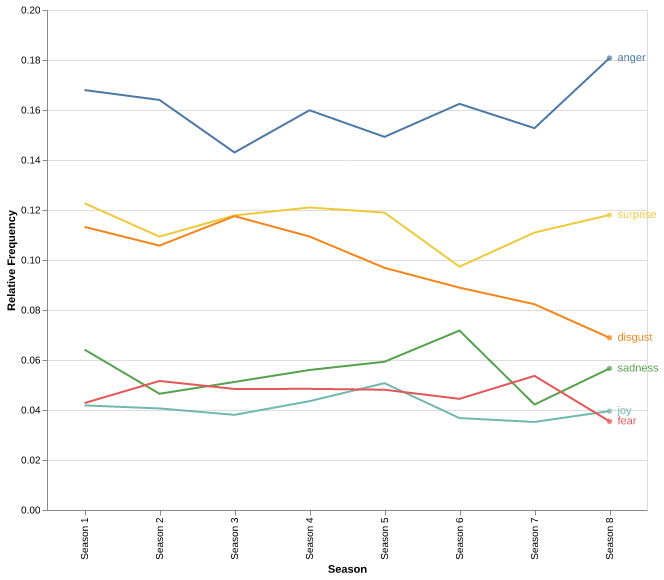

# Assignment 4

#### Victor Rasmussen
##### Aarhus University, Language Analytics

## Assessing Data
 

   This plot shows the distribution of predictions across the dataset. The neutral feeling is most prevelent in the dataset by far, accounting for almost half of dataset (48%).

Throughout the analysis i will not be show neutral in the plot, as this can be ragarded as a feeling which is not of intereset, while in relative frequencies the values are still used to calculate these.

    

 

